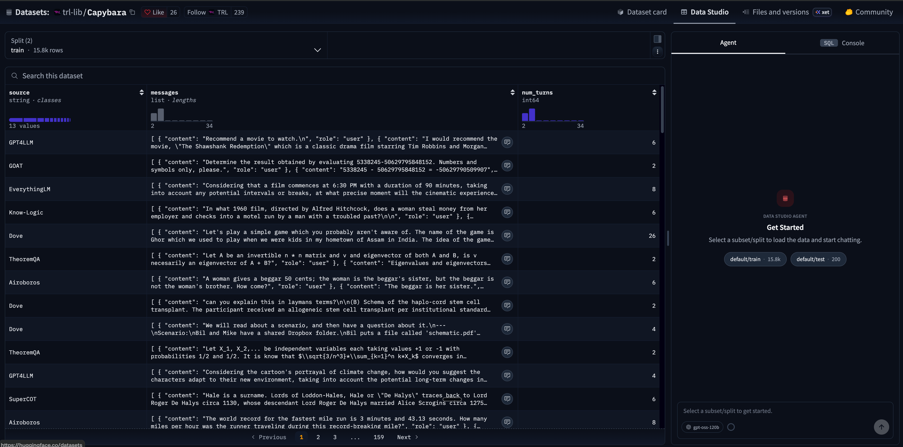

# SFT 101

## Context

Here, we'll be following [this tutorial](https://huggingface.co/docs/trl/jobs_training?script_type=python).

### How does the LLM do out-of-the-box?

...

### Why do we need to fine-tune?

...

(take a regular auto-completion dataset and then get it to be chat-working)

(simple example would be pasting an output from the regular Qwen model and then the post-trained version)

### What is Hugging Face Jobs?

Hugging Face Jobs lets us run training scripts while HF manages the infrastructure. TRL jobs is a wrapper on top of HF Jobs that provides default optimized configurations so that we can easily fine-tune models.

All of this gets us to the point where we can focus on fine-tuning instead of infra details.

## Model and dataset

We'll be training the `Qwen/Qwen3-0.6B` model on the `trl-lib/Capybara` dataset. The `trl-lib/Capybara` dataset is Hugging Face's training-ready reformat of the Capybara instruciton-tuning dataset.

The dataset is used for SFT of chat-oriented models. It lets us teach models what conversation-style interactions look like. The original Capybara dataset is designed to teach LLMs what "conversations" look like; the actual dataset is a synthetic multi-turn dataset. It's not useful for things like preference training or alignment, it's used for making sure that models can follow conversation-style interactions.

Here's a peek at what some of these chats look like:

```json
[
  {
    "source": "GOAT",
    "messages": [
      {
        "role": "user",
        "content": "Determine the result obtained by evaluating 5338245-50629795848152. Numbers and symbols only, please."
      },
      {
        "role": "assistant",
        "content": "5338245 - 50629795848152 = -50629790509907"
      }
    ],
    "num_turns": 2
  },
  {
    "source": "Dove",
    "messages": [
      {
        "role": "user",
        "content": "Use m to substitute p, a to substitute e, n to substitute a, g to substitute c, o to substitute h,\nhow to spell peach under this rule?"
      },
      {
        "role": "assistant",
        "content": "Using the given substitutions, the word \"peach\" would be spelled as \"mango\"."
      }
    ],
    "num_turns": 2
  },
  {
    "source": "Dove",
    "messages": [
      {
        "role": "user",
        "content": "Which weighs more, a pound of feathers or two pounds of lead?"
      },
      {
        "role": "assistant",
        "content": "Two pounds of lead weighs more than a pound of feathers."
      }
    ],
    "num_turns": 2
  },
  {
    "source": "GOAT",
    "messages": [
      {
        "role": "user",
        "content": "Find the result of 71491786629148+5596789891. Numbers and symbols only, please."
      },
      {
        "role": "assistant",
        "content": "71491786629148 + 5596789891 = 71497383419039"
      }
    ],
    "num_turns": 2
  },
  {
    "source": "TaskSource",
    "messages": [
      {
        "role": "user",
        "content": "The verb to ellam means to find fault with; express criticism of; point out real or perceived flaws. Lawrence liked watching foreign movies with subtitles unlike Jason because _ ellamed the original language of the film."
      },
      {
        "role": "assistant",
        "content": "Jason."
      }
    ],
    "num_turns": 2
  }
]
```

To see more, check out the [Hugging Face dataset page](https://huggingface.co/datasets/trl-lib/Capybara).



## What's in this folder

This folder has these files:

- `runner.py`: This handles submitting the `train.py` as a Hugging Face job. It manages uploading the script, dependencies, files, and configuration details that Hugging Face needs to execute the job.
- `train.py`: defines the actual training run.

## What happens when we run the code?

When we run the runner using `uv run python cookbooks/fine_tuning_llms/trl_jobs/runner.py`, the job gets submitted to Hugging Face Jobs. We can check the status of the job in the [Hugging Face jobs page](https://huggingface.co/jobs/).


We can take a look at the Wandb project page to see how it's looking:


With a few more clicks, we can see the logs related to the given project run:


## What's actually happening during training?

### (Optional, math-heavy read) What calculations happen during training?

Let's go over what calculations are happening during the training phase. This requires some deep math background and comfort with linear algebra and matrix calculus. If this isn't your cup of tea, no worries! Skip this section, as it's mostly optional and more for understanding what's happening under the hood.

Let's discuss what happens, step by step.

#### What are we predicting?

LLMs are next-token predictors. In the most literal sense, this means consistently predicting what tokens come up next, over and over, until the LLM predicts that the response should stop. Current models are pretty good at this, a far cry from the days of GPT and GPT-2, where models would get stuck in weird infinite glitches and repeat themselves over and over until they hit a max character limit.

When models are trained, they're given sentences. For example, an LLM might be trained on the following sentence:

> "The quick brown fox jumped over the lazy dog"

We split the sentence up so that for each chunk of the sentence, we predict the next word:

- "The" -> "quick"
- "The quick" -> "brown"
- "The quick brown" -> fox"
- ...
- "The quick brown fox jumped over the lazy" -> "dog"

#### Vocabulary and math

Let's establish some vocabulary:

- `V`: the size of the token vocabulary. This is all the "words" that the LLM knows. For our model, `V=151,936`.
- `B`: the batch size. For us, `B=8`.
- `S`: the longest conversation. Since the matrix has to be square, the length of the longest conversation determines this, but it maxes out at `S=1,024`.

An LLM can be decomposed, in very simplified terms, as having two parts:

1. Transformer layers: this is what does the "thinking".
2. Output project matrix: this maps the transformer layers to the vocabulary. This is the "final translation" that maps what the LLM was thinking into tokens that we can interpret.

The stack up to the last transfer layer returns hidden states with shape:

$$H \in \mathbb{R}^{BxSxD}, d=896$$

*Dimensionality is a defined hyperparameter, 896 is a good default.

At the last step, we have an output project matrix, which takes the last hidden state of the transformer layers (the "thinking" of the transformer) and translates that into tokens. Concretely, if we denote the output project as a matrix $W \in \mathbb{R}^{Vxd}$, then the output of this step (and therefore, the output of the model itself) is the following:

$$Z = HW^T \in \mathbb{R}^{BxSxV}$$

#### What does the model actually spit out?

The output that we actually see is the logits, which tell you, at each position, the probability that the model assigned to all possible tokens.

Recall that the first dimension, $B$, corresponds to each of the $B$ sentences in our batch. Let's take one of those sentences and see the logit output:

> "The quick brown fox jumped over the lazy dog"

For this sentence, its corresponding logit output has shape $(1, S, V)$. Let's say this is the first sentence of our batch. Let's then zoom in at what's in the second entry of this tensor, at $(0, 1, V)$.

The scores that the LLM assigned to predict the next token for the substring "The quick" are defined in:

$$Z_{0,1,V} \in \mathbb{R}^V$$

The LLM considers and assigns a score for how likely each of the `V=151,936` tokens are to be the next token. These are scores that are assigned by the model. These scores aren't necessarily normalized nor can they be directly compared, so you can't look at a single logit value and interpret much without seeing the rest of the values.

However, we can take that logit vector and get a vector of probabilities by taking the softmax over the vocabulary axis. Concretely, if $Z_{b,t,v}$ is one logit value, we can calculate the probability of a token, given its logit value, with the equation:

$$p_{b,t,v} = \frac{\exp{Z_{b,t,v}}}{\sum_{u=0}^{V-1}\exp{Z_{b,t,u}}}$$

This new vector of softmax values gives us the predicted probabilities of the next token, what the model thinks should come next after "The quick". We can do a few things here:

1. We can take the most likely token and just say that it's our next token.
2. We can tell the model what token actually came next, and then see how likely the model thought that was (we call this the "surprise" metric).

...

First, we take a batch of conversations. It's computationally easier to
1. Take a batch of 8 conversations.
2. For each conversation, turn it into a 1,024-token sequence. We add padding to each sequence that's too short, and truncate the longer ones. We get a tensor, in our scenario, of shape `(8, 1,024)`.
3. For each of the 8 conversations in the batch, we predict each token given

In pseudocode, what we're doing looks something like this:


```markdown
for epoch in (1, 2, 3):
    for batch in batches: # 1 batch = 8 conversations.
        tokens = c
```

We're doing SFT, so we update all the weights in our model.

### When do we see logging?

Metrics are logged every 10 optimizer steps. We run this training run for 3 epochs (~50 minutes of training on the A100). We have 15,808 training examples, and we run them in batches of 8 examples, which gives us 1,976 steps per epoch.
