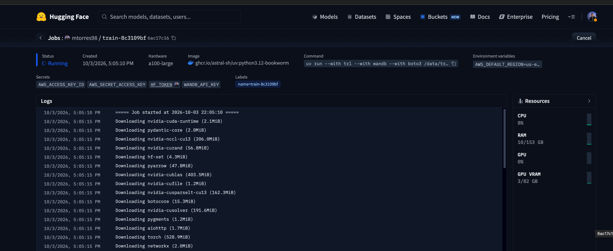
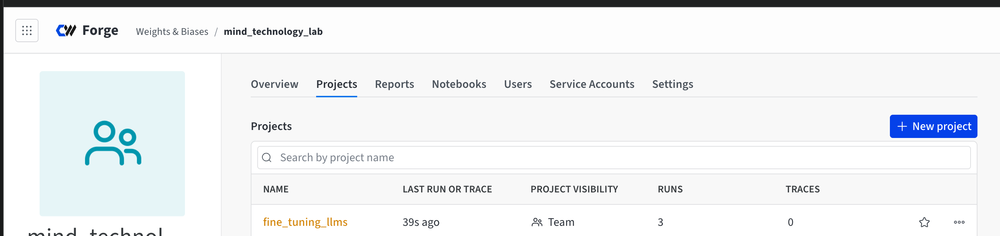
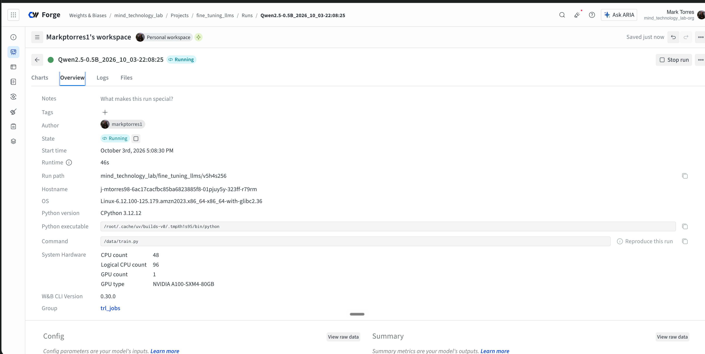

# Hugging Face Jobs and TRL

Here, we'll be following [this tutorial](https://huggingface.co/docs/trl/jobs_training?script_type=python).

Hugging Face Jobs lets us run training scripts while HF manages the infrastructure. TRL jobs is a wrapper on top of HF Jobs that provides default optimized configurations so that we can easily fine-tune models.

All of this gets us to the point where we can focus on fine-tuning instead of infra details.

We'll be training the `Qwen/Qwen3-0.6B` model on the `trl-lib/Capybara` dataset. The `trl-lib/Capybara` dataset is Hugging Face's training-ready reformat of the Capybara instruciton-tuning dataset.

The dataset is used for SFT of chat-oriented models. It lets us teach models what conversation-style interactions look like. The original Capybara dataset is designed to teach LLMs what "conversations" look like; the actual dataset is a synthetic multi-turn dataset. It's not useful for things like preference training or alignment, it's used for making sure that models can follow conversation-style interactions.

Here's a peek at what some of these chats look like:

```json
[
  {
    "source": "GOAT",
    "messages": [
      {
        "role": "user",
        "content": "Determine the result obtained by evaluating 5338245-50629795848152. Numbers and symbols only, please."
      },
      {
        "role": "assistant",
        "content": "5338245 - 50629795848152 = -50629790509907"
      }
    ],
    "num_turns": 2
  },
  {
    "source": "Dove",
    "messages": [
      {
        "role": "user",
        "content": "Use m to substitute p, a to substitute e, n to substitute a, g to substitute c, o to substitute h,\nhow to spell peach under this rule?"
      },
      {
        "role": "assistant",
        "content": "Using the given substitutions, the word \"peach\" would be spelled as \"mango\"."
      }
    ],
    "num_turns": 2
  },
  {
    "source": "Dove",
    "messages": [
      {
        "role": "user",
        "content": "Which weighs more, a pound of feathers or two pounds of lead?"
      },
      {
        "role": "assistant",
        "content": "Two pounds of lead weighs more than a pound of feathers."
      }
    ],
    "num_turns": 2
  },
  {
    "source": "GOAT",
    "messages": [
      {
        "role": "user",
        "content": "Find the result of 71491786629148+5596789891. Numbers and symbols only, please."
      },
      {
        "role": "assistant",
        "content": "71491786629148 + 5596789891 = 71497383419039"
      }
    ],
    "num_turns": 2
  },
  {
    "source": "TaskSource",
    "messages": [
      {
        "role": "user",
        "content": "The verb to ellam means to find fault with; express criticism of; point out real or perceived flaws. Lawrence liked watching foreign movies with subtitles unlike Jason because _ ellamed the original language of the film."
      },
      {
        "role": "assistant",
        "content": "Jason."
      }
    ],
    "num_turns": 2
  }
]
```

This folder has two key files:

- `runner.py`: This handles submitting the `train.py` as a Hugging Face job. It manages uploading the script, dependencies, files, and configuration details that Hugging Face needs to execute the job.
- `train.py`: defines the actual training run.

When we run, we can check the status of the job in the [Hugging Face jobs page](https://huggingface.co/jobs/).



We can take a look at the Wandb project page to see how it's looking:



With a few more clicks, we can see the logs related to the given project run:


