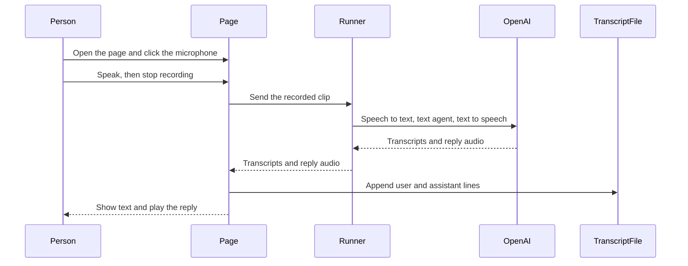

# Build a Streamlit voice discussion page

## Remember

- Exact file paths always
- Exact commands with expected output
- DRY, YAGNI, TDD, frequent commits
- Delegated tasks must be impossible to misread.

## Overview

The issue discussion folder only has a spec file today. The spec file names a Next.js UI and a FastAPI backend. The spec file stays unchanged. The work on this branch follows the requested Streamlit page instead, all in Python.

A person will click a microphone, speak a turn, hear the assistant speak back, read both sides of the transcript on the page, and find the same transcript on disk.

## Happy flow

A person starts Streamlit from the repo root, records one clip with the microphone control, and hears the spoken reply. The page shows the user line and the assistant line, and those two lines are appended to a session file under the experiment outputs folder.

## Approach

Use the Python chained voice path from the OpenAI voice-agents guide, because the UI is Streamlit and because we must keep a written transcript after each turn. The chained voice path turns speech into text, runs a text agent, then turns the reply back into speech. Do not use the JavaScript live-audio session helpers.

Keep three modules in the experiment folder: the page, the voice runner, and the system prompt. Add the Python packages to the root project so the existing root virtual environment can run the page. Create one timestamped output folder per browser session, and append two JSON objects per turn.

## Decisions

1. **Branch and PR.** All work stays on `init-issue-discussion-platform`. Promote that branch to a pull request. Do not create another branch.
2. **Language.** Python only. No JavaScript, no Next.js, no browser WebRTC client.
3. **Environment.** Add Streamlit, the OpenAI Agents SDK with the voice extra, and python-dotenv to `/Users/mark/src/work/mind_technology_lab_experiments/pyproject.toml`. Use the root `uv` environment. Do not add an experiment-local project file.
4. **How to run.** Every command is run from `/Users/mark/src/work/mind_technology_lab_experiments`. Do not insert entries into `sys.path` in Python source. Make `shared` and `issue_discussion_platform` importable by installing this repo as a package during the root `uv sync`.
5. **Tests.** Do not add test files. Do not change `/Users/mark/src/work/mind_technology_lab_experiments/tests/test_scaffold.py`. Confirm the work by running the page and reading the transcript file.
6. **Page and backend.** One Streamlit script at `/Users/mark/src/work/mind_technology_lab_experiments/issue_discussion_platform/app.py` is the UI and the process that calls the voice runner.
7. **Voice runner.** `/Users/mark/src/work/mind_technology_lab_experiments/issue_discussion_platform/voice_agent.py` owns recording-format conversion, the chained voice pipeline, and the functions that create the session folder and append transcript lines. The page calls those functions after each successful turn.
8. **Prompt.** `/Users/mark/src/work/mind_technology_lab_experiments/issue_discussion_platform/prompts.py` holds the system prompt, using labeled sections from the realtime prompting guide. Skip tool, escalation, and live-audio wait-tool sections, because this slice has no tools and is not a live speech-to-speech model.
9. **Microphone and playback.** Use Streamlit's built-in audio recorder at 24000 Hz, which matches the Agents SDK default for complete clips. Play the reply with Streamlit's audio player, with autoplay on.
10. **Transcript file.** Path is `/Users/mark/src/work/mind_technology_lab_experiments/issue_discussion_platform/outputs/<timestamp>/chat.jsonl`. The timestamp is local time in `YYYYMMDD_HHMMSS` form, created once per browser session. Each line is one JSON object with keys `role` and `content`. `role` is `"user"` or `"assistant"`. Append the user object, then the assistant object, after each successful turn.
11. **Secrets.** Read `OPENAI_API_KEY` through `/Users/mark/src/work/mind_technology_lab_experiments/shared/load_env_vars.py` from the repo-root `.env`.
12. **Spec file.** Do not edit `/Users/mark/src/work/mind_technology_lab_experiments/issue_discussion_platform/SPECS.md`.

## Steps

### Step 1: Make the experiment importable and add root packages

Add the runtime packages to the root project, ignore session output files, add empty package markers, and create stub modules for the page, the voice runner, and the prompt. See [steps/step1.md](steps/step1.md).

### Step 2: Write the system prompt

Fill the prompt module with short labeled sections for role, personality, language, verbosity, unclear audio, and variety, taken from the realtime prompting guide. See [steps/step2.md](steps/step2.md).

### Step 3: Run one voice turn and write the transcript

Implement conversion from a recorded clip, one chained pipeline turn that returns user text, assistant text, and reply audio, and append those two JSON objects to the session file. See [steps/step3.md](steps/step3.md).

### Step 4: Wire the Streamlit page

On first load, create the session folder. On each new recording, call the voice runner, print the transcript, play the reply, and keep one runner instance for the browser session so later turns have history. See [steps/step4.md](steps/step4.md).

### Step 5: Run from the repo root and confirm the happy path

Start the page from the repo root, record a clip, hear the reply, and confirm `chat.jsonl` has the user and assistant lines. Capture after screenshots. See [steps/step5.md](steps/step5.md).

## What "done" looks like

1. `uv run streamlit run issue_discussion_platform/app.py`, run from the repo root, opens a page with a microphone control.
2. After a person records a clip, the page shows the user transcript and the assistant transcript, and the browser plays the spoken reply.
3. The same two lines exist in `issue_discussion_platform/outputs/<timestamp>/chat.jsonl` as `role`/`content` objects, one object per line.
4. Later recordings in the same browser session append to the same file and keep conversation history.
5. The system prompt lives in `issue_discussion_platform/prompts.py` and follows the labeled-section structure from the realtime prompting guide.
6. Runtime packages live in the root `pyproject.toml`. There is no experiment-local project file, no JavaScript, no `sys.path` edits in source, and no new test files.
7. `issue_discussion_platform/SPECS.md` is unchanged.
