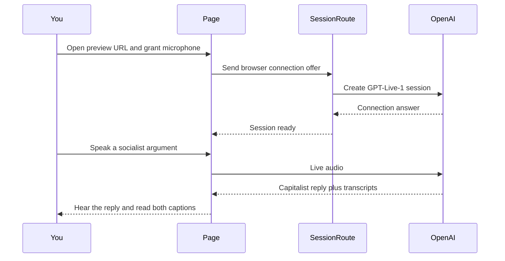

# Ship a GPT-Live-1 voice debate that argues for capitalism under enlightened disagreement rules

## Remember
- Exact file paths always
- Exact commands with expected output
- DRY, YAGNI, TDD, frequent commits
- Delegated tasks must be impossible to misread.

## Overview

OpenAI published GPT-Live-1 in the public API on 10 September 2026. We'll add a one-page Next.js experiment at `gpt_live_enlightened_disagreement/` where you argue for socialism out loud, and a GPT-Live-1 agent argues for capitalism using Kellogg's enlightened disagreement methods.

The Litowitz Center news-research page is empty today. The principles file will cite the Center's home page, curriculum, February 2024 launch, September 2025 naming gift, and writing by Eli Finkel and Nour Kteily, because the news-research page has no papers to quote.

## Happy flow

You open the Vercel preview URL and sign in with Vercel Authentication. You grant the microphone and start a call. You argue for socialism. The agent replies as a capitalist devil's advocate. It restates your claim and states the strongest version of that claim, then argues the capitalist side without treating you as a villain. Captions for both sides stay on the page so you can read what each of you said.

## Approach

We'll keep spoken conversation on GPT-Live-1. We'll put the longer debate rules plus any fact lookup on the Responses backend, because OpenAI designed Live to keep speech on Live and longer rules on Responses. The browser never holds the OpenAI key. We'll keep session creation on a Next.js server route. We'll put the experiment in a standalone folder, because the work is a product demo. Paper replications belong under `autoresearch/`.

The agent is one voice. It argues for capitalism, and it uses enlightened disagreement moves (restate, steelman, correct caricature, ask for the strongest case against a view) while it argues. It does not split into a second speaker.

## Decisions

1. Voice model. Use GPT-Live-1. It is public and billed at $0.05 per minute of voice. OpenAI's 10 September 2026 API post names it as the Live model. If session creation fails because the project lacks Live access, switch to GPT-Realtime-2.1 on the Realtime contract. Don't mix Live and Realtime event names in one client.
2. One devil's advocate agent. Confirmed. The same voice argues for capitalism and runs the exchange with Kellogg tools. It restates your claim, states the strongest socialist case, and then argues against the claim you actually made. It doesn't try to produce agreement or a milder middle view.
3. Fixed roles. Confirmed. You are locked as pro-socialism. There's no role switcher in the first version.
4. Repo path. New folder `gpt_live_enlightened_disagreement/` at the repo root. We'll put the Next.js App Router app in that folder, and we'll set Vercel Root Directory to the same folder.
5. Vercel. Confirmed. Create a new project on the only available team, `marktorres10s-projects`. Preview deploy from this branch. Turn on Vercel Authentication so strangers cannot spend voice minutes.
6. Principles file. Write `gpt_live_enlightened_disagreement/ENLIGHTENED_DISAGREEMENT_PRINCIPLES.md` from the Kellogg URLs in Step 1. Live prompts and backend prompts both load from that file.

The empty news-research page means the principles file is assembled from other Center pages and papers, not from a Center-published moderator handbook. The agent will sound like a moderator who seeks agreement if the prompt only says "be a moderator." The prompt must order the moves as restate, then steelman, then argue for capitalism.

## Steps

### Step 1: Write the Kellogg principles file

Research the Litowitz Center pages and Finkel and Kteily writing, then write `gpt_live_enlightened_disagreement/ENLIGHTENED_DISAGREEMENT_PRINCIPLES.md` with cited rules, named non-goals, and quotes. Mark any audio-moderator mapping as inference. See [steps/step1.md](steps/step1.md).

### Step 2: Scaffold the Next.js experiment

Create a minimal App Router app in `gpt_live_enlightened_disagreement/` with a health page, Node runtime, example env file, and README. Confirm `npm run dev` and `npm run build` succeed locally. See [steps/step2.md](steps/step2.md).

### Step 3: Create Live sessions and cover the route with tests

Add a server route that exchanges a browser connection offer for a GPT-Live-1 session and keeps the API key on the server. The route rejects a bad origin or a missing offer. Write tests that fail first, then pass, against a stubbed OpenAI client. Cover success, missing key, bad origin, and a fallback when Live is unavailable. See [steps/step3.md](steps/step3.md).

### Step 4: Connect microphone audio and captions

Build the browser WebRTC path so that after you press Start, the page connects the microphone and speaker, waits until the session is ready, and renders overlapping user and assistant captions, because GPT-Live-1 can listen and speak at the same time. End the call and release the microphone on Stop. See [steps/step4.md](steps/step4.md).

### Step 5: Encode the capitalism vs socialism debate

Load the principles file into the short live prompt and the longer backend prompt. The live prompt covers tone, interruption handling, and when to ask the backend for help. The backend prompt holds the capitalist case, the strongest version of the socialist case, and the Kellogg rules. Keep hosted web search on the backend for current facts. See [steps/step5.md](steps/step5.md).

### Step 6: Ship the one-page audio UI

Put role labels, connection status, Start and Stop, captions, and a short cost and consent note on a single page. Capture before and after screenshots in `docs/plans/2026-09-11_gpt-live-enlightened-disagreement_9dbac1/images/`. See [steps/step6.md](steps/step6.md).

### Step 7: Deploy to Vercel and verify the call

Create the Vercel project with Root Directory `gpt_live_enlightened_disagreement/` and set the OpenAI key on the project. Enable Vercel Authentication and deploy a preview from this branch. Confirm the preview page loads, session creation fails clearly without a key, and a real call works with a microphone on HTTPS. See [steps/step7.md](steps/step7.md).

## What "done" looks like

1. `gpt_live_enlightened_disagreement/` is a Next.js App Router app that deploys to a Vercel preview URL.
2. `gpt_live_enlightened_disagreement/ENLIGHTENED_DISAGREEMENT_PRINCIPLES.md` exists, is cited, and is the source of the agent's debate rules.
3. You can start a voice call on HTTPS, argue for socialism, and hear a capitalist devil's advocate reply that restates and then answers the claim.
4. Captions for both sides appear during the call. Start and Stop work. The microphone is released on Stop.
5. The OpenAI key never appears in the browser bundle. A missing key shows an explicit error. The fallback that runs when Live is unavailable also shows an explicit error.
6. Automated tests cover session creation success and the main failure cases.
7. Custom voices, phone, avatar, multi-user rooms, stored recordings, Qwen, and Hugging Face Jobs stay out of this experiment.
