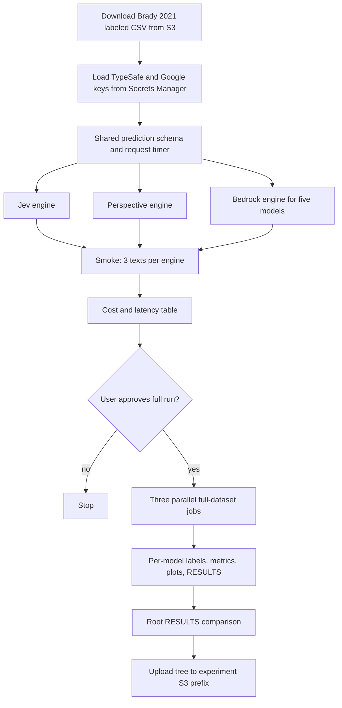

# Compare Jev, Perspective, and Bedrock models on Brady 2021 moral outrage labels

## Remember
- Exact file paths always
- Exact commands with expected output
- DRY, YAGNI, TDD, frequent commits
- Delegated tasks must be impossible to misread.

## Overview

Issue 17 asks you to score the Brady 2021 labeled moral outrage tweets with TypeSafe Jev, the Perspective API moral outrage score, and five Amazon Bedrock chat models used as binary classifiers. The root RESULTS file then reports quality, latency, and cost for every scorer, and it reports how the Jev and Perspective probabilities compare.

The labeled file is the 26,000-row training CSV from Brady, McLoughlin, Doan, and Crockett. The file is already at `s3://met-research-group-datasets/moral_outrage_classifier/26k_training_data.csv`. The Bedrock models are GPT-5.6 Luna, GPT-5.6 Terra, Claude Sonnet 5, Qwen3-32B, and DeepSeek V3.1.

The work belongs in a new standalone experiment folder. `autoresearch/` is for paper replications, and the job is a lab comparison. The root uv workspace still lists only `autoresearch/*` as members, the same rule that already applies to `mech_interp_reddit/` and `openai_rate_limit_scaling/`.

## Happy flow

Because a full Bedrock pass is five models times about 26,000 calls, you see a smoke table before the full Bedrock spend. You read the experiment README and run a smoke pass on three texts for every engine. You then check a cost and latency table. After you approve the smoke table, three parallel engine jobs write labels, metrics, plots, and writeups, then upload the same tree to S3.

## Approach

Share one prediction record and one request timer, because otherwise F1 and p99 are not the same measurement across engines. Keep provider logic in three engines that reuse the loop in `data_platform/generate_features/engines/base.py` in [METResearchGroup/mirrorView-task](https://github.com/METResearchGroup/mirrorView-task/tree/main/data_platform/generate_features). The loop batches work and retries failures. The loop also skips rows that already have labels and writes a deadletter file. Stop after smoke for a human cost gate, because Bedrock cost dominates the full run.

## Decisions

I locked the choices below. If one is wrong, change it in Please confirm.

1. **Folder.** Create `experiments/moral_outrage_classification_2026_09_19/` with the README, SETUP, RESULTS, models, outputs, and shared layout named in issue 17.

2. **Dependency install.** Treat the folder as a standalone experiment with its own dependency file. Do not add it to the root uv workspace. Keep it out of root ruff and pyright, matching `mech_interp_reddit/` and `openai_rate_limit_scaling/` in `/workspace/pyproject.toml`.

3. **Jev.** Run Jev through the official TypeSafe Python SDK (`typesafe-sdk`) and `jev-latest`. Ask one yes/no probability question whose instructions use the Brady 2021 definition: feelings about a perceived moral violation, anger or disgust or contempt, and blame or a wish to punish. The TypeSafe [quick start](https://docs.typesafe.ai/introduction/quickstart#code-it-the-python-sdk) and [primitives](https://docs.typesafe.ai/primitives) pages are the docs for the Jev request.

4. **Perspective.** Request the experimental `MORAL_OUTRAGE` attribute on AnalyzeComment. Public Perspective docs often omit `MORAL_OUTRAGE`. If AnalyzeComment rejects the attribute, fail the smoke test. Do not switch to `TOXICITY`. Perspective is free. Default quotas are often near 1 request per second, so 26,000 rows can take about 7 hours.

5. **Bedrock.** Use one engine and five model IDs. Resolve the exact in-region IDs during setup. Current AWS cards use `openai.gpt-5.6-luna`, `openai.gpt-5.6-terra`, `qwen.qwen3-32b-v1:0` or `qwen.qwen3-32b`, and `deepseek.v3-v1:0` or `deepseek.v3.1`. Confirm Claude Sonnet 5 against `aws bedrock list-foundation-models` in the working region. Each call returns a structured yes/no label under the same Brady definition. A probability field is required when the model can emit one. Models that only emit a hard label still enter the F1 table and drop out of calibration plots.

6. **Binary metrics.** Convert every probability to a label at 0.5. Report F1, accuracy, precision, and recall against the Brady gold labels. Report request latency at p50, p90, and p99 from the shared timer.

7. **Calibration.** Compare Jev and Perspective probabilities only, as issue 17 asks. Plot a bar histogram for each score. Plot the paired difference (Jev minus Perspective) and report mean, median, standard deviation, and interquartile range. Do not add extra calibration methods in the first writeup.

8. **Smoke gate.** Classify three fixed texts on Jev, Perspective, and each of the five Bedrock models. Write a table with model name (`Jev`, `Perspective API`, or `Bedrock:{model ID}`), total tokens, estimated cost, and median runtime. Perspective cost is $0. Stop and wait for approval before the full dataset.

9. **Full run.** After approval, run Jev, Perspective, and Bedrock as three parallel jobs. The Bedrock job scores all five models. Each model writes `labels.parquet`, `results.json`, `static/` plots, and `RESULTS.md` under the output path named in issue 17. After all jobs finish, write the root `RESULTS.md` and notify you.

10. **Artifact storage.** Write the same tree locally and to `s3://mind-technology-lab-experiments/experiments/moral_outrage_classification_2026_09_19/`. Use the lab AWS keys named in `/workspace/AGENTS.md`.

11. **Secrets.** Load the TypeSafe / Jev key and `GOOGLE_API_KEY` from AWS Secrets Manager. After discovery, write the exact secret names into `experiments/moral_outrage_classification_2026_09_19/SETUP.md`. The current cloud environment has `AWS_ACCESS_KEY_ID` set and no `AWS_REGION` or `LAB_AWS_ACCESS_KEY_ID`. Setup must record the working region before any Bedrock or Secrets Manager call.

12. **Prompt text.** Use one shared Brady definition for Jev and every Bedrock model. If each model gets its own wording, the F1 table mixes prompt changes with scorer changes.

## Steps

With the twelve decisions fixed, start with the folder and the labeled CSV, then the engines, then the smoke gate.

### Step 1: Scaffold the experiment folder and documents

Create `experiments/moral_outrage_classification_2026_09_19/` with README, SETUP, and a RESULTS stub. The README links [issue 17](https://github.com/METResearchGroup/mind_technology_lab_experiments/issues/17), SETUP, and RESULTS. SETUP lists the dataset URI, required secrets, Bedrock model access, the output bucket, and the working AWS region.

### Step 2: Load the labeled CSV and credentials

Download `s3://met-research-group-datasets/moral_outrage_classifier/26k_training_data.csv`. Inspect the header and lock the text column and gold label column in SETUP. Load the TypeSafe key and Google API key from Secrets Manager, and write the discovered secret names into SETUP.

### Step 3: Lock the shared record, timer, and metrics

Define one prediction record used by every engine: row id, text, gold label, model name, probability, binary label at 0.5, latency, token counts, and estimated cost. Add a shared request timer around every remote call. Write unit tests for thresholding, the four classification metrics, and latency percentiles before any live call.

### Step 4: Implement the three engines

Build the Jev engine on the official TypeSafe SDK, the Perspective engine on AnalyzeComment with `MORAL_OUTRAGE`, and the Bedrock engine so one runner can target each of the five named models. Reuse the loop in `data_platform/generate_features/engines/base.py` that batches work and retries failures. The loop also skips rows that already have labels and writes a deadletter file. Do not copy Bluesky campaign code from mirrorView-task.

### Step 5: Run smoke tests and publish the cost table

Classify three fixed texts on Jev, Perspective, and each Bedrock model. Write the model, token, cost, and median runtime table into the root RESULTS stub. Stop here.

### Step 6: Run the full dataset in three parallel jobs after approval

Once you approve the smoke table, run Jev, Perspective, and Bedrock in parallel. The Bedrock job scores all five models. Each model writes labels, metrics, bar charts, and its own RESULTS file. The runner writes failed rows to a deadletter file with the error and the attempt count.

### Step 7: Write the root comparison and upload to S3

Fill the root RESULTS file with the quality table, the latency table, the cost table, and the Jev versus Perspective histograms and difference summary. Upload the local tree to `s3://mind-technology-lab-experiments/experiments/moral_outrage_classification_2026_09_19/`. Notify you that the run is finished.

## What "done" looks like

1. `experiments/moral_outrage_classification_2026_09_19/` exists with README, SETUP, RESULTS, models, shared timer code, smoke tests, and the output tree named in issue 17.
2. SETUP names the dataset URI, secret names, Bedrock model IDs, working AWS region, and output prefix.
3. Smoke tests classify three texts on Jev, Perspective, and each of the five Bedrock models, then print the cost and latency table.
4. No Bedrock or Perspective traffic on the full dataset starts until you approve the smoke table.
5. After approval, every model has labels, metrics JSON, plots, and a RESULTS file. Failed rows are in a deadletter file.
6. Root RESULTS reports F1, accuracy, precision, recall, p50/p90/p99 latency, tokens, and cost for every model.
7. Root RESULTS also has bar histograms for Jev and Perspective scores, plus mean, median, standard deviation, and interquartile range of Jev minus Perspective.
8. The local tree is uploaded to `s3://mind-technology-lab-experiments/experiments/moral_outrage_classification_2026_09_19/`.
9. Root lint and CI still ignore the new experiment folder, matching the other experiment trees.

## Please confirm

I still need four facts from you, because they change spend and wiring.

1. After smoke, should the full run score all 26,000 rows, or a cheaper subsample? The plan assumes all 26,000 unless you reject the smoke cost table.
2. Is Perspective's experimental `MORAL_OUTRAGE` attribute the intended endpoint, or does the lab have a private Jigsaw URL?
3. Which AWS region should Bedrock and Secrets Manager use? The current cloud environment has no region set.
4. What are the Secrets Manager names for the TypeSafe key and `GOOGLE_API_KEY`?
