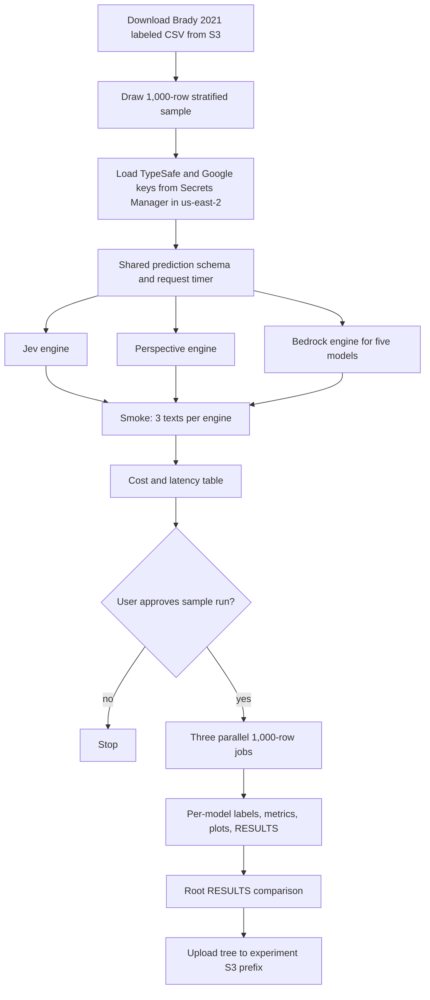

# Compare Jev, Perspective, and Bedrock models on Brady 2021 moral outrage labels

## Remember
- Exact file paths always
- Exact commands with expected output
- DRY, YAGNI, TDD, frequent commits
- Delegated tasks must be impossible to misread.

## Overview

Issue 17 asks you to score Brady 2021 labeled moral outrage tweets with TypeSafe Jev, the Perspective API moral outrage score, and five Amazon Bedrock chat models used as binary classifiers. You write a root RESULTS file that reports quality, latency, and cost for every scorer, and that reports how the Jev and Perspective probabilities compare.

The labeled file is the 26,000-row training CSV from Brady, McLoughlin, Doan, and Crockett. The file is already at `s3://met-research-group-datasets/moral_outrage_classifier/26k_training_data.csv`. After you download it, you draw one stratified random sample of 1,000 posts and you keep that sample for every later score. The Bedrock models are GPT-5.6 Luna, GPT-5.6 Terra, Claude Sonnet 5, Qwen3-32B, and DeepSeek V3.1.

The work belongs in a new standalone experiment folder. `autoresearch/` is for paper replications, and the job is a lab comparison. The root uv workspace still lists only `autoresearch/*` as members, the same rule that already applies to `mech_interp_reddit/` and `openai_rate_limit_scaling/`.

## Happy flow

Because a Bedrock pass is five models times 1,000 calls, you see a smoke table before the Bedrock spend. You read the experiment README and run a smoke pass on three texts for every engine. You then check a cost and latency table. After you approve the smoke table, three parallel engine jobs score the same 1,000-row sample, write labels, metrics, plots, and writeups, then upload the same tree to S3.

## Approach

Use one prediction record and one request timer, because otherwise F1 and p99 are not the same measurement across engines. Keep provider logic in three engines that reuse the loop in `data_platform/generate_features/engines/base.py` in [METResearchGroup/mirrorView-task](https://github.com/METResearchGroup/mirrorView-task/tree/main/data_platform/generate_features). You reuse a loop that batches work, retries failures, skips rows that already have labels, and writes a deadletter file. Stop after smoke for a human cost gate, because Bedrock cost dominates the 1,000-row run.

## Decisions

The choices below are confirmed.

1. **Folder.** Create `experiments/moral_outrage_classification_2026_09_19/` with the README, SETUP, RESULTS, models, outputs, and shared layout named in issue 17.

2. **Dependency install.** Treat the folder as a standalone experiment with its own dependency file. Do not add it to the root uv workspace. Keep it out of root ruff and pyright, matching `mech_interp_reddit/` and `openai_rate_limit_scaling/` in `/workspace/pyproject.toml`.

3. **Sample.** Draw one stratified random sample of 1,000 posts from the 26,000-row file at the start. Keep the same gold-label mix as the full file (14,563 label 0 and 11,437 label 1, so the sample is 560 label 0 and 440 label 1). Write the sample to disk once. Every engine scores that file. Do not score the other 25,000 rows.

4. **Row id.** Use the original CSV row number as the row id. The tweet id column is empty on 1,160 rows and repeats on 27 ids, so it cannot identify a row.

5. **Jev.** Run Jev through the official TypeSafe Python SDK (`typesafe-sdk`) and `jev-latest`. Ask one yes/no probability question whose instructions use the Brady 2021 definition: feelings about a perceived moral violation, anger or disgust or contempt, and blame or a wish to punish. The TypeSafe [quick start](https://docs.typesafe.ai/introduction/quickstart#code-it-the-python-sdk) and [primitives](https://docs.typesafe.ai/primitives) pages are the docs for the Jev request.

6. **Perspective.** Request the experimental `MORAL_OUTRAGE` attribute on AnalyzeComment. Public Perspective docs often omit `MORAL_OUTRAGE`. If AnalyzeComment rejects the attribute, fail the smoke test. Do not switch to `TOXICITY`. Perspective is free. Default quotas are often near 1 request per second, so 1,000 rows can take about 17 minutes.

7. **Bedrock.** Use one engine and five model IDs in `us-east-2`. Call GPT-5.6 Luna, GPT-5.6 Terra, and Claude Sonnet 5 through the US inference profiles `us.openai.gpt-5.6-luna`, `us.openai.gpt-5.6-terra`, and `us.anthropic.claude-sonnet-5`. Call Qwen3-32B and DeepSeek V3.1 on demand as `qwen.qwen3-32b-v1:0` and `deepseek.v3-v1:0`. Each call returns a structured yes/no label under the same Brady definition. A probability field is required when the model can emit one. Models that only emit a hard label still enter the F1 table and drop out of calibration plots.

8. **Region.** Hardcode `us-east-2` as the AWS region for Secrets Manager, Bedrock, dataset download, and artifact upload. Do not read `AWS_REGION` or `AWS_DEFAULT_REGION` for the working region.

9. **Secrets.** Load the TypeSafe key from Secrets Manager secret `jev-typesafe-api-key` (JSON field `TYPESAFE_API_KEY`). Load the Google key from secret `google-api-key` (JSON field `GOOGLE_API_KEY`). Copy the JSON-secret read in `cookbooks/how_to_use_aws_secrets_manager/main.py` on `main`. Prefer `LAB_AWS_ACCESS_KEY_ID` and `LAB_AWS_ACCESS_KEY_SECRET` from `/workspace/AGENTS.md`. If those names are empty, use `AWS_ACCESS_KEY_ID` and map `AWS_ACCESS_KEY_SECRET` to the standard secret-key env name.

10. **Binary metrics.** Convert every probability to a label at 0.5. Report F1, accuracy, precision, and recall against the Brady gold labels. Report request latency at p50, p90, and p99 from the shared timer.

11. **Calibration.** Compare Jev and Perspective probabilities only, as issue 17 asks. Plot a bar histogram for each score. Plot the paired difference (Jev minus Perspective) and report mean, median, standard deviation, and interquartile range. Do not add extra calibration methods in the first writeup.

12. **Smoke gate.** Classify three fixed texts on Jev, Perspective, and each of the five Bedrock models. Write a table with model name (`Jev`, `Perspective API`, or `Bedrock:{model ID}`), total tokens, estimated cost, and median runtime. Perspective cost is $0. Stop and wait for approval before the 1,000-row jobs.

13. **Sample run.** After approval, run Jev, Perspective, and Bedrock as three parallel jobs on the same 1,000-row file. The Bedrock job scores all five models. Each model writes `labels.parquet`, `results.json`, `static/` plots, and `RESULTS.md` under the output path named in issue 17. After all jobs finish, write the root `RESULTS.md` and notify you.

14. **Artifact storage.** Write the same tree locally and to `s3://mind-technology-lab-experiments/experiments/moral_outrage_classification_2026_09_19/`. Use the lab AWS keys named in `/workspace/AGENTS.md`.

15. **Prompt text.** Use one shared Brady definition for Jev and every Bedrock model. If each model gets its own wording, the F1 table mixes prompt changes with scorer changes.

## Steps

Start with the folder and the labeled CSV, then the engines, then the smoke gate.

### Step 1: Scaffold the experiment folder and documents

Create `experiments/moral_outrage_classification_2026_09_19/` with README, SETUP, a RESULTS stub, a local dependency file, and the empty models, shared, and outputs tree from issue 17. Exclude the folder from root ruff and pyright. See [steps/step1.md](steps/step1.md).

### Step 2: Load the labeled CSV, draw the sample, and load credentials

Download the 26,000-row CSV. Confirm the text column and the gold label column. Draw the 1,000-row stratified sample and write it to disk. Load the TypeSafe key and the Google key from the named Secrets Manager secrets in `us-east-2`. See [steps/step2.md](steps/step2.md).

### Step 3: Confirm the shared record, timer, and metrics

Define one prediction record used by every engine, plus a shared request timer around every remote call. Write unit tests for thresholding, the four classification metrics, and latency percentiles before any live call. See [steps/step3.md](steps/step3.md).

### Step 4: Implement the three engines

Build the Jev engine on the official TypeSafe SDK, the Perspective engine on AnalyzeComment with `MORAL_OUTRAGE`, and the Bedrock engine so one runner can target each of the five named models. Reuse the batch, retry, skip-seen, and deadletter loop from the mirrorView-task engine base. Do not copy Bluesky campaign code. See [steps/step4.md](steps/step4.md).

### Step 5: Run smoke tests and publish the cost table

Classify three fixed texts on Jev, Perspective, and each Bedrock model. Write the model, token, cost, and median runtime table into the root RESULTS stub. Stop here. See [steps/step5.md](steps/step5.md).

### Step 6: Run the 1,000-row sample in three parallel jobs after approval

Once you approve the smoke table, run Jev, Perspective, and Bedrock in parallel on the sample file. The Bedrock job scores all five models. Each model writes labels, metrics, bar charts, and its own RESULTS file. The runner writes failed rows to a deadletter file with the error and the attempt count. See [steps/step6.md](steps/step6.md).

### Step 7: Write the root comparison and upload to S3

Fill the root RESULTS file with the quality table, the latency table, the cost table, and the Jev versus Perspective histograms and difference summary. Upload the local tree to `s3://mind-technology-lab-experiments/experiments/moral_outrage_classification_2026_09_19/`. Notify you that the run is finished. See [steps/step7.md](steps/step7.md).

## What "done" looks like

1. `experiments/moral_outrage_classification_2026_09_19/` exists with README, SETUP, RESULTS, models, shared timer code, smoke tests, and the output tree named in issue 17.
2. SETUP names the dataset URI, secret `jev-typesafe-api-key`, secret `google-api-key`, the five Bedrock IDs, region `us-east-2`, the 1,000-row sample rule, and the output prefix.
3. A 1,000-row sample file exists with 560 gold-label 0 rows and 440 gold-label 1 rows, drawn once with a fixed seed.
4. Smoke tests classify three texts on Jev, Perspective, and each of the five Bedrock models, then print the cost and latency table.
5. No Bedrock or Perspective traffic on the 1,000-row sample starts until you approve the smoke table.
6. After approval, every model has labels, metrics JSON, plots, and a RESULTS file for the sample. Failed rows are in a deadletter file.
7. The root RESULTS file has F1, accuracy, precision, recall, p50/p90/p99 latency, tokens, and cost for every model.
8. The root RESULTS file also has bar histograms for Jev and Perspective scores, plus mean, median, standard deviation, and interquartile range of Jev minus Perspective.
9. You upload the local tree to `s3://mind-technology-lab-experiments/experiments/moral_outrage_classification_2026_09_19/`.
10. Root lint and CI still ignore the new experiment folder, matching the other experiment trees.

## Addendum 2026-09-19: use stored Perspective labels, drop unit tests

Issue 17 now says the live Perspective `MORAL_OUTRAGE` endpoint is unavailable, and that labels already exist at `s3://met-research-group-datasets/moral_outrage_classifier/perspective_api_labeled_26k_twitter_dataset.csv`.

Keep `PerspectiveApiEngine` and its public methods. Change only the body: load that file and return the stored label. Do not call AnalyzeComment. Do not ask for `TOXICITY`. Do not load `GOOGLE_API_KEY` for Perspective.

The stored file has one row per Brady training row, in the same order. The score column is `pred_label` (0, 1, or empty). 189 of 26,000 rows have no `pred_label`. The current 1,000-row sample has 7 of those empty rows. Drop empty Perspective labels when you compare models. Do not redraw the sample.

Perspective smoke must read three rows from that file. It must not use the three invented smoke strings, because those strings are not in the file.

Delete every pytest file under `experiments/moral_outrage_classification_2026_09_19/tests/`. Do not add new unit tests. Check the work with the live commands in the step files.

The current sample drops these seven `source_row_id` values because `pred_label` is empty: `1990`, `6429`, `19057`, `19803`, `19853`, `19977`, `22320`. Perspective then scores 993 rows (554 gold 0 and 439 gold 1). Do not redraw the sample to replace them.

See [steps/step1.md](steps/step1.md), [steps/step2.md](steps/step2.md), [steps/step3.md](steps/step3.md), [steps/step4.md](steps/step4.md), [steps/step5.md](steps/step5.md), [steps/step6.md](steps/step6.md), and [steps/step7.md](steps/step7.md).

## Addendum 2026-09-19: repurpose the mirrorView Bedrock engine

Issue 17 now names the Bedrock source file and says to reuse it: [bedrock_engine.py](https://github.com/METResearchGroup/mirrorView-task/blob/main/data_platform/generate_features/engines/bedrock_engine.py).

Copy the Converse call, the Pydantic output schema, the JSON parse, the short inner retry, and the content-filter error from that file. Do not use Converse tool JSON. Do not default to Nova Micro. Do not import `FeatureSpec` or campaign types.

Keep `BedrockEngine`, the five locked model IDs, region `us-east-2`, the Brady instruction string, and the experiment `label_records` loop.

See [steps/step4.md](steps/step4.md) and [steps/step5.md](steps/step5.md).
