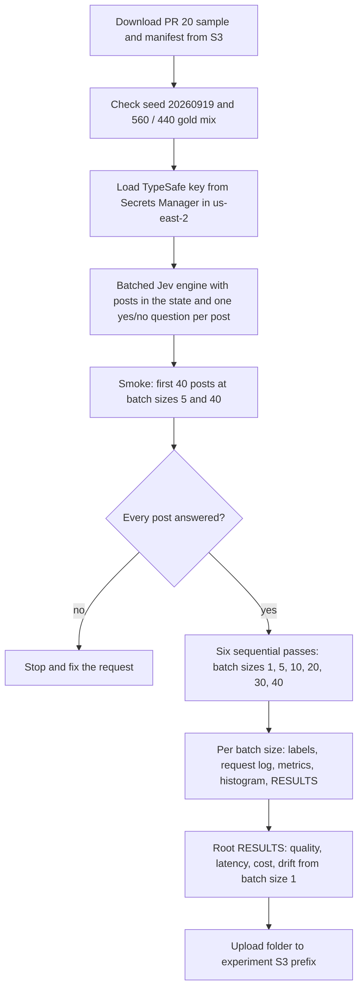

# Measure how much batching posts into one Jev request speeds up moral outrage scoring

## Remember
- Exact file paths always
- Exact commands with expected output
- DRY, YAGNI, TDD, frequent commits
- Delegated tasks must be impossible to misread.

## Overview

Issue 17 and PR 20 scored the same 1,000 Brady 2021 tweets with Jev, Perspective, and five Bedrock models. Jev sent one post per request. On that run Jev reached an F1 of 0.732, a p50 request latency of 131 ms, and about 350 input tokens per post. The cost column said "unknown", because the experiment had no Jev price.

This experiment scores only Jev on the same 1,000 posts, and it packs several posts into each request. You run batch sizes of 1, 5, 10, 20, 30, and 40 posts per request. For each batch size, you report the PR 20 quality metrics (F1, accuracy, precision, recall), the PR 20 latency percentiles, the total wall time for 1,000 posts, token counts, and estimated cost. You also report how far each batched run moves away from the batch size 1 labels.

Batching should lower cost as well as wall time. About 260 of the 350 input tokens per post in PR 20 are fixed overhead for each request, because the post averages about 35 tokens and the Brady definition adds about 55. When 40 posts share one request, that overhead is paid once instead of 40 times. At the official price of $0.042 per million input tokens, the batch size 1 run costs about $0.015 and the batch size 40 run should cost about $0.004. All six runs together should cost less than $0.05.

The main risk is quality. The TypeSafe notes on known Jev 1.13 weak spots say that accuracy falls as the state grows with content that does not bear on the question. In a batch of 40 posts, 39 posts are unrelated to each question, so F1 may fall as the batch size grows. The six passes measure how far F1 falls at each batch size, next to how much time and money each batch size saves.

The work goes in `experiments/speedup_jev_2026_09_23/`, a standalone experiment in the same form as `experiments/moral_outrage_classification_2026_09_19/`.

## Happy flow

You download the PR 20 sample, run a small smoke test, and then run six full passes over the 1,000 posts, one pass per batch size. A comparison script writes one RESULTS table across the six passes and uploads the folder to S3.

## Approach

Change only one thing from PR 20, which is the number of posts in each request. The sample, the Brady definition text, the 0.5 threshold, and the metric code stay the same, so any change in F1 comes from batching. Batch size 1 is rerun today with the new request format, so the baseline is measured on the same day, model version, and code path as the batched runs. The PR 20 Jev numbers appear as a reference row.

## Decisions

These choices are proposed. Please confirm or change them before the step files are written.

1. **Folder.** Create `experiments/speedup_jev_2026_09_23/` with README, SETUP, RESULTS, a local dependency file, and `models/`, `shared/`, `scripts/`, `data/`, and `outputs/` folders. Keep it out of the root uv workspace, root ruff, and root pyright, in the same way as `experiments/moral_outrage_classification_2026_09_19/` in `/workspace/pyproject.toml`.

2. **Code reuse.** Copy the small helpers the new experiment needs from `experiments/moral_outrage_classification_2026_09_19/shared/`. The helpers are the Secrets Manager key load, the request timer, the metric functions, and the Brady definition string. Do not import across experiment folders, because `/workspace/AGENTS.md` says each experiment is independent.

3. **Sample.** Download `data/sample_1000.parquet` and `data/sample_1000.manifest.json` from `s3://mind-technology-lab-experiments/experiments/moral_outrage_classification_2026_09_19/`. Fail if the manifest does not show seed `20260919`, 1,000 rows, 560 gold 0, and 440 gold 1. Do not redraw the sample.

4. **Batch sizes.** Run 1, 5, 10, 20, 30, and 40 posts per request. Sort posts by the original CSV row id and cut them into consecutive groups. At batch size 30, the last request holds 10 posts. Every other batch size divides 1,000 evenly.

5. **Request shape.** Put the posts of one batch in the state as a numbered list. Ask one yes/no probability question per post. Each question names its post by list position and repeats the full Brady definition from PR 20. The TypeSafe docs use the same pattern in their counting example, with one question per list item in one request. Repeating the definition in every question keeps each question the same as the PR 20 question. Putting the definition in the state once would save more tokens, but the question would then have to point to a second part of the state, and the TypeSafe notes say that kind of indirection lowers accuracy.

6. **Model version.** Pin `jev-1.13.0` instead of `jev-latest`, so all six passes use the same weights even if the alias moves during the run. Record the model version that each response reports. PR 20 did not record which version `jev-latest` pointed to, so the PR 20 reference row may come from an earlier model.

7. **Request order.** Send one request at a time and wait for each response. Latency then measures one request and does not include time spent waiting behind other requests. At 1,000 requests, batch size 1 takes about 2 to 3 minutes, and larger batch sizes take less.

8. **Failures.** Retry a whole batch on HTTP 429, HTTP 5xx, or a timeout, up to 3 extra tries. After the last try fails, write every post in that batch to a deadletter file with the error and the attempt count. Treat a response that is missing an answer for any post in the batch as a failure of that batch.

9. **Cost.** Use $0.042 per million input tokens and $0 for output tokens, from the [TypeSafe models page](https://docs.typesafe.ai/models) as read on 2026-09-23. Also apply that price to the PR 20 Jev token counts, so the reference row has a cost.

10. **Metrics per batch size.** Report the following.
    - F1, accuracy, precision, and recall against the Brady gold labels, with probabilities cut at 0.5.
    - Request latency at p50, p90, and p99.
    - Latency per post, which is request latency divided by the number of posts in that request, at p50.
    - Total wall time for all 1,000 posts.
    - Total input tokens, total output tokens, and estimated cost in USD.
    - Agreement with the batch size 1 labels, and the mean absolute difference between each post's probability and its batch size 1 probability.
    - A bar histogram of Jev probabilities.
    - The deadletter count.

11. **Gate.** Run a smoke test on the first 40 posts at batch sizes 5 and 40, and check that every post gets an answer. Do not wait for human approval before the full runs, because all six passes together should cost less than $0.05.

12. **Secrets and region.** Load the TypeSafe key from Secrets Manager secret `jev-typesafe-api-key` (JSON field `TYPESAFE_API_KEY`) in `us-east-2`. Prefer `LAB_AWS_ACCESS_KEY_ID` and `LAB_AWS_ACCESS_KEY_SECRET`. If those are empty, use `AWS_ACCESS_KEY_ID` and `AWS_ACCESS_KEY_SECRET`, as PR 20 did.

13. **Artifact storage.** Write the same tree locally and to `s3://mind-technology-lab-experiments/experiments/speedup_jev_2026_09_23/`.

## Steps

### Step 1: Scaffold the experiment folder and documents

Create `experiments/speedup_jev_2026_09_23/` with README, SETUP, a RESULTS stub, a local dependency file, and the empty folders from decision 1. Copy the helpers named in decision 2, and add the folder to the root ruff and pyright exclude lists.

### Step 2: Download the sample and load the key

Download the PR 20 sample and manifest from S3 and check them against decision 3. Load the TypeSafe key from Secrets Manager and make one single-post request to confirm the key works.

### Step 3: Build the batched Jev engine

Build one engine that takes a list of posts, sends one request in the shape from decision 5, and returns one prediction per post. Every post in a request shares that request's latency and token counts, and each prediction also records the request index and the number of posts in the request. Write the batch loop with the retry, skip-already-scored, and deadletter rules from decision 8.

### Step 4: Run the smoke test

Score the first 40 posts at batch sizes 5 and 40. Print, for each batch size, the number of posts answered, the median request latency, the input tokens, and the estimated cost. Stop if any post has no answer.

### Step 5: Run the six full passes

Run batch sizes 1, 5, 10, 20, 30, and 40 over all 1,000 posts, one pass after another. Each pass writes its labels, a log with one row per request, a metrics file, a histogram, and its own RESULTS file under `outputs/batch_{size}/`.

### Step 6: Write the comparison and upload to S3

Fill the root RESULTS file with the quality, latency, cost, and drift tables from decision 10, with one row per batch size and one PR 20 reference row. Add a plot of F1 and per-post latency against batch size. Upload the folder to the S3 prefix from decision 13.

## What "done" looks like

1. `experiments/speedup_jev_2026_09_23/` exists with README, SETUP, RESULTS, the engine, the scripts, and one output folder per batch size.
2. The experiment used the PR 20 sample without redrawing it, and the manifest check passed.
3. Each of the six batch sizes scored all 1,000 posts, or its deadletter file lists every post that failed with its error.
4. The root RESULTS file has F1, accuracy, precision, recall, p50/p90/p99 request latency, p50 latency per post, total wall time, tokens, and estimated cost for each batch size and for the PR 20 reference row.
5. The root RESULTS file shows, for each batch size, agreement with batch size 1 and the mean absolute probability difference, together with a plot of F1 and per-post latency against batch size.
6. The local tree is uploaded to `s3://mind-technology-lab-experiments/experiments/speedup_jev_2026_09_23/`.
7. Root lint and CI still ignore the new experiment folder.
