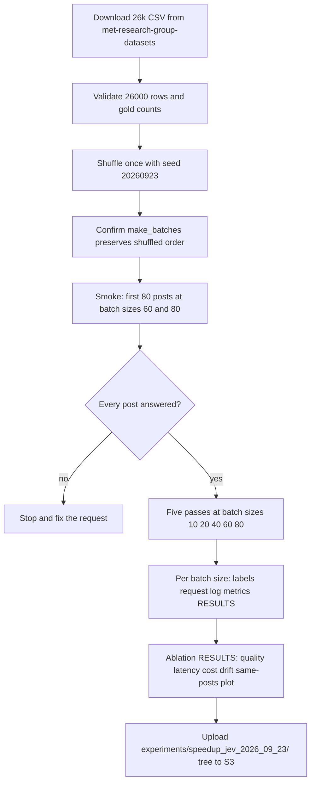

# Run a full 26k Jev batching ablation alongside the main 1,000-post experiment

## Remember
- Exact file paths always
- Exact commands with expected output
- DRY, YAGNI, TDD, frequent commits
- Delegated tasks must be impossible to misread.

## Overview

The main experiment in `experiments/speedup_jev_2026_09_23/` scored 1,000 stratified posts at batch sizes 1, 5, 10, 20, 30, and 40. F1 fell from 0.752 at batch size 1 to 0.635 at batch size 40. That sample is stratified and small. The source CSV has 26,000 posts with clustered file order, so batch composition on consecutive row ids may not match random mixing at scale.

This ablation scores all 26,000 posts from `s3://met-research-group-datasets/moral_outrage_classifier/26k_training_data.csv` at batch sizes 10, 20, 40, 60, and 80. It shuffles once with seed `20260923` before batching so every batch size sees the same random order. It reuses the tested engine, runner, limiter, metrics, and pricing from the main experiment. It lives in a separate subfolder and does not change main-run outputs.

Estimated spend is about $0.60, about 5,300 requests, and about 10 minutes of API time. There is no batch size 1 pass on the full data.

## Happy flow

Download the full CSV, confirm counts, shuffle with a fixed seed, run a smoke test on the first 80 shuffled posts, then run five full passes one after another. Write ablation RESULTS with quality, latency, cost, drift, a same-posts comparison against the main 1,000-post run, and upload the experiment tree to S3.

## Approach

Keep the main experiment untouched. Put all ablation-specific code under `experiments/speedup_jev_2026_09_23/ablation_full_dataset/`. Add `shared/full_dataset.py` for download, validation, and shuffle. Import post-processing helpers from the main `scripts/run_batch_size.py` instead of copying them. If `make_batches` re-sorts by `source_row_id`, add an opt-in order mode that preserves the task list order without changing the default used by the main run.

## Decisions

These choices were confirmed on 2026-09-23.

1. **Separate ablation folder.** Everything lives in `experiments/speedup_jev_2026_09_23/ablation_full_dataset/` with `README.md`, generated `RESULTS.md`, `scripts/` (`fetch_full_dataset.py`, `smoke.py`, `run_batch_size.py`, `write_results.py`), `outputs/batch_N/` and `outputs/smoke/`, and gitignored `data/`. Shared data code goes in `shared/full_dataset.py`. Reuse the engine (`models/batched_jev.py`), runner (`shared/batch_runner.py`), limiter (`shared/rate_limiter.py`), metrics, and pricing unchanged. Reuse per-pass post-processing from `scripts/run_batch_size.py` by importing it; small parameterization there is allowed only if main-run outputs stay byte-identical when regenerated. Main experiment results are not touched. S3 prefix is `s3://mind-technology-lab-experiments/experiments/speedup_jev_2026_09_23/ablation_full_dataset/` via the existing `scripts/upload_s3.py`, which uploads the whole experiment tree.

2. **Shuffle before batching.** Load all 26,000 posts and validate counts (14,563 gold 0, 11,437 gold 1). Shuffle once with fixed seed `20260923` before batching. Every batch size uses the same shuffled order. Confirm that `run_pass` and `make_batches` preserve the given order and do not re-sort by `source_row_id`. If they sort, fix by passing tasks in shuffled order with an opt-in preserve-order mode, without changing main-run behavior.

3. **Batch sizes.** Run 10, 20, 40, 60, and 80 only. No batch size 1 pass on the full data.

4. **Concurrency and throughput.** Keep 8 threads and the 1,000 request starts per minute cap. SDK retries off. Same retry and deadletter rules as the main run. The batch size 10 pass has 2,600 requests, so the cap binds. Report sustained throughput as posts per minute = `n_scored / wall_time_seconds * 60`, and compare it to the projection of 1,000 requests/min × batch size.

5. **Smoke gate.** Score the first 80 shuffled posts at batch sizes 60 and 80. Every post must be answered before full passes.

6. **Reporting in `ablation_full_dataset/RESULTS.md`.**
   - Quality: F1, accuracy, precision, recall, scored, deadletter.
   - Latency: request p50/p90/p99, per-post p50, wall time, sustained posts per minute, projected posts per minute.
   - Cost: requests, tokens, USD, USD per 1,000 posts, and projected cost and time for 20M posts at 1,000 requests/min.
   - Drift vs batch size 10 on the full data: agreement and mean absolute difference.
   - Same-posts table: for batch sizes 10, 20, 40, F1 on the 1,000 main-sample `source_row_id`s from the ablation run, next to main-run F1 at the same batch size, plus label agreement between the two runs on those posts.
   - Share-of-reference-F1 column using main-run batch size 1 F1 of 0.752, labeled as measured on the 1,000-post sample, not the full data.
   - Plot of F1 and per-post latency vs batch size.
   Notes must say this is a separate ablation, that there is no batch size 1 on the full data, the shuffle seed, and model `jev-1.13.0`.

7. **Estimated spend.** About $0.60, about 5,300 requests, and about 10 minutes of runs.

8. **CHANGELOG and PR.** Add a CHANGELOG entry and a clearly separated PR section titled "Ablation: full 26k dataset (separate from the main experiment)".

## Steps

### Step 1: Scaffold the ablation folder and full-dataset loader

See [steps/step1.md](steps/step1.md).

Create `ablation_full_dataset/` with README, RESULTS stub, scripts stubs, output folders, and `shared/full_dataset.py`. Implement CSV download, count validation, and shuffled task loading.

### Step 2: Preserve shuffle order, wire run scripts, and smoke test

See [steps/step2.md](steps/step2.md).

Confirm or fix order handling in `make_batches` and `run_pass`. Parameterize main `scripts/run_batch_size.py` for import by the ablation script. Run smoke on the first 80 shuffled posts at batch sizes 60 and 80.

### Step 3: Run the five full passes

See [steps/step3.md](steps/step3.md).

Run batch sizes 10, 20, 40, 60, and 80 over all 26,000 shuffled posts, one pass after another. Each pass writes outputs under `ablation_full_dataset/outputs/batch_{size}/`.

### Step 4: Write ablation RESULTS, upload, and update CHANGELOG

See [steps/step4.md](steps/step4.md).

Fill `ablation_full_dataset/RESULTS.md` with the tables and plot from decision 6. Upload via `scripts/upload_s3.py`. Add the CHANGELOG entry and PR section text.

## What "done" looks like

1. `experiments/speedup_jev_2026_09_23/ablation_full_dataset/` exists with README, RESULTS, scripts, and output folders for smoke and each batch size.
2. All 26,000 posts were validated, shuffled with seed `20260923`, and scored at batch sizes 10, 20, 40, 60, and 80 (or deadletters list every failure).
3. `ablation_full_dataset/RESULTS.md` has quality, latency (including sustained and projected throughput), cost (including 20M projection), drift from batch size 10, same-posts comparison for batch sizes 10/20/40, share-of-reference-F1, and the F1/latency plot.
4. The experiment tree is uploaded to `s3://mind-technology-lab-experiments/experiments/speedup_jev_2026_09_23/`.
5. Main-run outputs under `outputs/batch_*` are unchanged when regenerated.
6. `CHANGELOG.md` records the ablation with a separate PR section heading.
