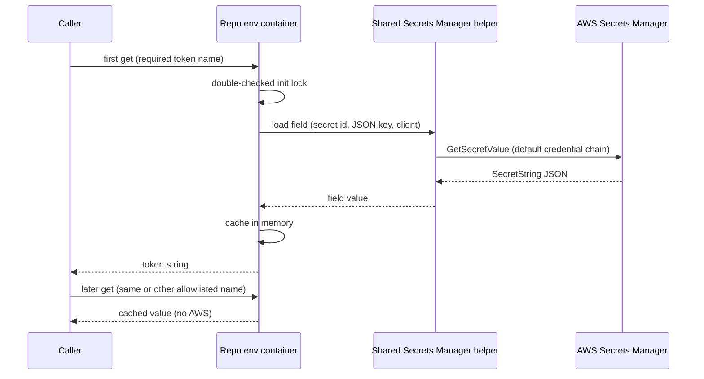

# Load repository secrets from AWS Secrets Manager at the repo root

## Remember
- Exact file paths always
- Exact commands with expected output
- DRY, YAGNI, TDD, frequent commits
- Delegated tasks must be impossible to misread.

## Overview

Add repo-root loading of agent credentials from AWS Secrets Manager instead of a dotenv file. A small shared AWS helper fetches one JSON field per secret id, and unit tests inject mock clients at that boundary. A thread-safe singleton env container initializes on first access, caches allowlisted values in memory, and never writes process environment variables. Packaging adds the AWS SDK dependency, extends static analysis to the new packages, and ships NumPy-style docstrings with mocked unit tests. A final live check confirms the documented GitHub personal access token secret resolves when the shell maps the lab secret key name to the name the SDK expects.

## Happy flow

An agent or script imports the env container, requests the GitHub personal access token with required semantics, and receives the cached string that singleton initialization loaded from the allowlisted secret. Later lookups use the cache and do not call AWS again.



## Approach

Mirror the control flow of the external mirrorView env loader: singleton, double-checked locking, and required versus optional versus unknown names. Replace dotenv and process-environment reads with one Secrets Manager fetch per allowlisted name at init. Model the generic Secrets Manager module on the speedup experiment secrets helper, including the same failure modes and message shapes, but without lab key resolution or experiment-specific loaders. Keep the region constant in a dedicated module. Unit tests mock the loader boundary, and live verification is a separate step that uses shell-only credential alias mapping.

## Steps

### Step 1: Shared region module, Secrets Manager helper, packaging, and unit tests

Add `/workspace/shared/aws/aws_region.py`, `/workspace/shared/aws/secretsmanager.py`, package init docstrings under `/workspace/shared/`, declare `boto3` in root `/workspace/pyproject.toml`, and `/workspace/tests/test_secretsmanager.py`. See `steps/step1.md`.

### Step 2: Repo-root env container and unit tests

Add `/workspace/lib/load_env_vars.py`, `/workspace/lib/__init__.py`, extend `/workspace/pyproject.toml` Pyright `include`, and `/workspace/tests/test_load_env_vars.py`. See `steps/step2.md`.

### Step 3: Live Secrets Manager verification

Run the documented one-liner after exporting the secret access key alias; no product changes unless a code bug is proven. See `steps/step3.md`.

## Verification (full slice)

After Steps 1 to 2 implementation commits:

```text
uv sync
uv run pytest -q
uv run ruff check shared lib tests
uv run ruff format --check shared lib tests
uv run pyright
```

Expected: `uv sync` succeeds; pytest exits 0 with all tests passed; ruff check and format check exit 0; pyright exits 0 with no errors on `shared`, `lib`, and `tests`.

After Step 3:

```text
export AWS_SECRET_ACCESS_KEY="$AWS_ACCESS_KEY_SECRET"
uv run python -c "from lib.load_env_vars import EnvVarsContainer; value = EnvVarsContainer.get_env_var('GITHUB_PAT_TOKEN', required=True); print('ok', len(value))"
```

Expected stdout: exactly one line matching `ok <positive integer>` (integer > 0). Exit code 0. Must not print token material.

## Forbidden during implementation

Do not edit: `/workspace/experiments/`, `/workspace/cookbooks/`, `/workspace/autoresearch/`, `/workspace/AGENTS.md`, `/workspace/.github/`, `/workspace/vercel.json`, or any file under `/workspace/docs/plans/2026-09-24_load-env-from-secrets-manager_cb941a/`.

Do not delete `/workspace/tests/test_scaffold.py`.

Do not add `python-dotenv`. Do not add credential preflight checks before the Secrets Manager API call. Do not map `AWS_ACCESS_KEY_SECRET` to `AWS_SECRET_ACCESS_KEY` in product code.

## What "done" looks like

1. Root `/workspace/pyproject.toml` lists `boto3` in `[project] dependencies`; `[tool.uv] package = false` unchanged; `[tool.pyright] include` contains `shared`, `lib`, and `tests`.
2. `/workspace/shared/aws/aws_region.py` defines region `us-east-2` with module docstring including a `uv run python -c` smoke line matching the experiment style.
3. `/workspace/shared/aws/secretsmanager.py` exposes the Protocol, factory, and field loader; private JSON/string helpers; `SystemExit` messages name secret ids without secret material; only the factory constructs boto3 with default credentials and the shared region constant.
4. `/workspace/shared/__init__.py` and `/workspace/shared/aws/__init__.py` exist with package docstrings (NumPy style per CODING_RULES).
5. `/workspace/lib/load_env_vars.py` implements the thread-safe singleton env container with allowlist `{GITHUB_PAT_TOKEN → secret kova-github-pat, field GITHUB_PAT_TOKEN}`; init calls the shared field loader once per allowlisted name; no dotenv, no `.env`, no `os.environ` writes; unknown names behave like mirrorView; module docstring includes the safe `uv run python` length check command.
6. `/workspace/lib/__init__.py` exists with package docstring.
7. `/workspace/tests/test_secretsmanager.py` has one test class per public function in the Secrets Manager module; fakes only; covers success, missing field, invalid JSON, and ClientError paths.
8. `/workspace/tests/test_load_env_vars.py` monkeypatches the shared field loader, resets the singleton between tests, and covers required present/missing/empty, optional missing, unknown name, and init calling the loader with `kova-github-pat` and `GITHUB_PAT_TOKEN`.
9. All unit and static checks in Verification pass on the feature branch.
10. Live verification command prints `ok <positive integer>` and exit 0 with credentials aliased in the shell only.

## Executive summary

**Intent:** Plan-only package for repo-root env loading backed by Secrets Manager, aligned with mirrorView control flow and the speedup experiment secrets helper shape.

**Deliverables:** Router plan plus three step files under `/workspace/docs/plans/2026-09-24_load-env-from-secrets-manager_cb941a/`.

**Tests:** None written in this planning pass.

**Blockers:** None for planning.

**Risks:** Live verification fails if the shell omits the `AWS_SECRET_ACCESS_KEY` alias; singleton test isolation must reset class state; Pyright scope expansion may surface new issues in `tests/`.

**Next for orchestrator:** Implementation subagents per `steps/step1.md` → `step2.md` → `step3.md` using `/workspace/.cursor/skills/implement-from-spec/SKILL.md`.
