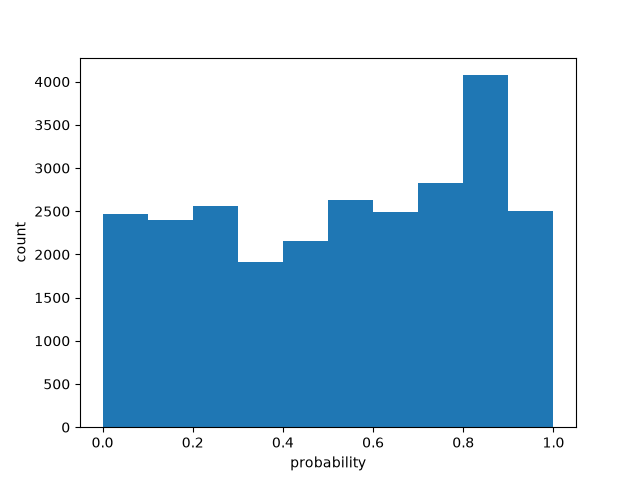

# Batch size 10

| metric | value |
| --- | ---: |
| batch_size | 10 |
| n_scored | 26000 |
| n_deadletter | 0 |
| n_requests | 2600 |
| f1 | 0.7127331586249422 |
| accuracy | 0.7133076923076923 |
| precision | 0.6372407139411481 |
| recall | 0.8085162192882749 |
| request_latency_ms_p50 | 115.41835849993731 |
| request_latency_ms_p90 | 163.55240049988424 |
| request_latency_ms_p99 | 299.1453950997032 |
| per_post_latency_ms_p50 | 11.541835849993731 |
| wall_time_seconds | 129.59113033599988 |
| input_tokens | 3220187 |
| output_tokens | 478400 |
| estimated_cost_usd | 0.135247854 |
| model_versions | ['jev-1.13.0'] |
| price_source | https://docs.typesafe.ai/models (2026-09-23) |

0 deadletters.
