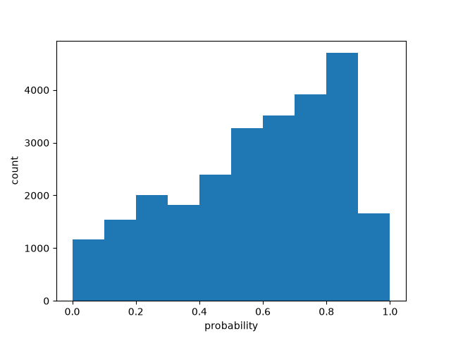

# Batch size 20

| metric | value |
| --- | ---: |
| batch_size | 20 |
| n_scored | 26000 |
| n_deadletter | 0 |
| n_requests | 1300 |
| f1 | 0.6621076626337016 |
| accuracy | 0.629423076923077 |
| precision | 0.5527579341843307 |
| recall | 0.8253912739354726 |
| request_latency_ms_p50 | 131.83773550008482 |
| request_latency_ms_p90 | 196.6238959998009 |
| request_latency_ms_p99 | 331.34612335979 |
| per_post_latency_ms_p50 | 6.591886775004241 |
| wall_time_seconds | 65.3094165829998 |
| input_tokens | 2889987 |
| output_tokens | 486200 |
| estimated_cost_usd | 0.12137945400000001 |
| model_versions | ['jev-1.13.0'] |
| price_source | https://docs.typesafe.ai/models (2026-09-23) |

0 deadletters.
