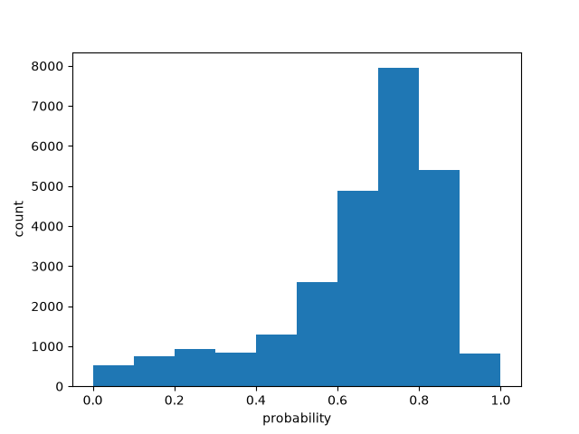

# Batch size 40

| metric | value |
| --- | ---: |
| batch_size | 40 |
| n_scored | 26000 |
| n_deadletter | 0 |
| n_requests | 650 |
| f1 | 0.6333383708629288 |
| accuracy | 0.5334230769230769 |
| precision | 0.48397080561714706 |
| recall | 0.9160619043455451 |
| request_latency_ms_p50 | 139.65826899948297 |
| request_latency_ms_p90 | 192.8683152999838 |
| request_latency_ms_p99 | 320.69773109954434 |
| per_post_latency_ms_p50 | 3.4914567249870743 |
| wall_time_seconds | 12.158098618000622 |
| input_tokens | 2724887 |
| output_tokens | 490100 |
| estimated_cost_usd | 0.11444525400000001 |
| model_versions | ['jev-1.13.0'] |
| price_source | https://docs.typesafe.ai/models (2026-09-23) |

0 deadletters.
