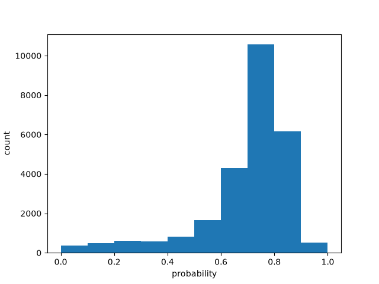

# Batch size 60

| metric | value |
| --- | ---: |
| batch_size | 60 |
| n_scored | 26000 |
| n_deadletter | 0 |
| n_requests | 434 |
| f1 | 0.6240392950014446 |
| accuracy | 0.49953846153846154 |
| precision | 0.4660164847020239 |
| recall | 0.9442161405963102 |
| request_latency_ms_p50 | 154.08161650020702 |
| request_latency_ms_p90 | 208.12236549954832 |
| request_latency_ms_p99 | 375.3826857603144 |
| per_post_latency_ms_p50 | 2.5695618000099785 |
| wall_time_seconds | 9.097633725999913 |
| input_tokens | 2670023 |
| output_tokens | 491396 |
| estimated_cost_usd | 0.11214096600000001 |
| model_versions | ['jev-1.13.0'] |
| price_source | https://docs.typesafe.ai/models (2026-09-23) |

0 deadletters.
