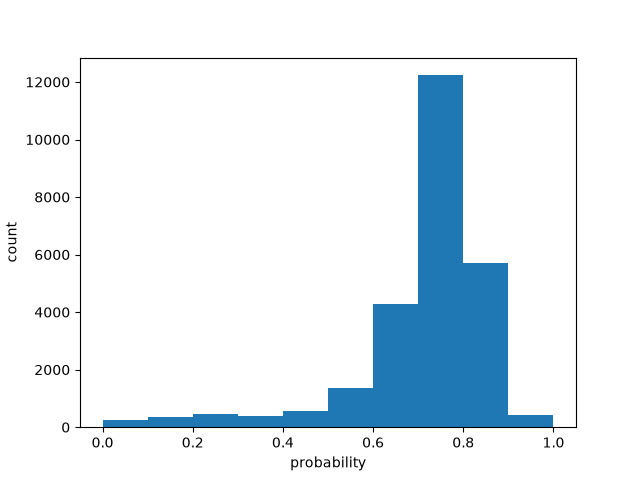

# Batch size 80

| metric | value |
| --- | ---: |
| batch_size | 80 |
| n_scored | 26000 |
| n_deadletter | 0 |
| n_requests | 325 |
| f1 | 0.6222184570202192 |
| accuracy | 0.48546153846153844 |
| precision | 0.4595203336809176 |
| recall | 0.963277083151176 |
| request_latency_ms_p50 | 160.60625499994785 |
| request_latency_ms_p90 | 212.88485020031658 |
| request_latency_ms_p99 | 374.7576400404068 |
| per_post_latency_ms_p50 | 2.007578187499348 |
| wall_time_seconds | 7.04073445999984 |
| input_tokens | 2642337 |
| output_tokens | 492050 |
| estimated_cost_usd | 0.11097815400000001 |
| model_versions | ['jev-1.13.0'] |
| price_source | https://docs.typesafe.ai/models (2026-09-23) |

0 deadletters.
