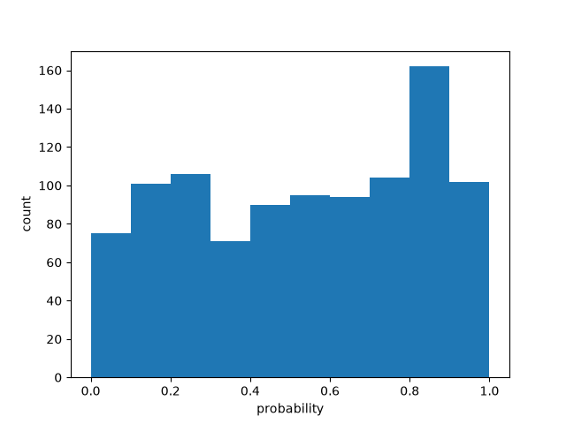

# Batch size 10

| metric | value |
| --- | ---: |
| batch_size | 10 |
| n_scored | 1000 |
| n_deadletter | 0 |
| n_requests | 100 |
| f1 | 0.7121364092276831 |
| accuracy | 0.713 |
| precision | 0.6373429084380611 |
| recall | 0.8068181818181818 |
| request_latency_ms_p50 | 127.50845649998155 |
| request_latency_ms_p90 | 228.40177549996972 |
| request_latency_ms_p99 | 319.8945442298374 |
| per_post_latency_ms_p50 | 12.750845649998155 |
| wall_time_seconds | 1.8816666610000539 |
| input_tokens | 124032 |
| output_tokens | 18400 |
| estimated_cost_usd | 0.005209344 |
| model_versions | ['jev-1.13.0'] |
| price_source | https://docs.typesafe.ai/models (2026-09-23) |

0 deadletters.
