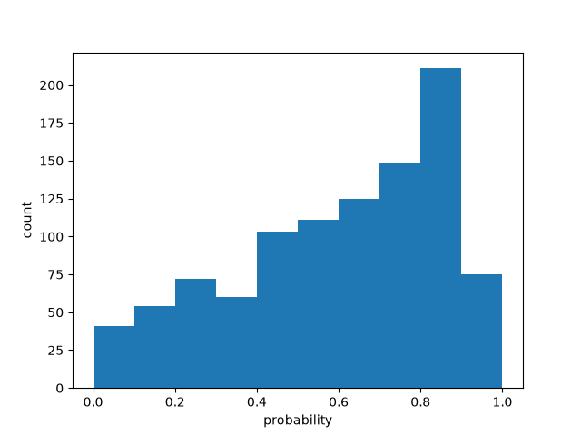

# Batch size 20

| metric | value |
| --- | ---: |
| batch_size | 20 |
| n_scored | 1000 |
| n_deadletter | 0 |
| n_requests | 50 |
| f1 | 0.6738738738738739 |
| accuracy | 0.638 |
| precision | 0.5582089552238806 |
| recall | 0.85 |
| request_latency_ms_p50 | 135.98871400017742 |
| request_latency_ms_p90 | 261.79525840002503 |
| request_latency_ms_p99 | 324.9191125200923 |
| per_post_latency_ms_p50 | 6.799435700008871 |
| wall_time_seconds | 1.0946760060000997 |
| input_tokens | 111332 |
| output_tokens | 18700 |
| estimated_cost_usd | 0.0046759440000000005 |
| model_versions | ['jev-1.13.0'] |
| price_source | https://docs.typesafe.ai/models (2026-09-23) |

0 deadletters.
