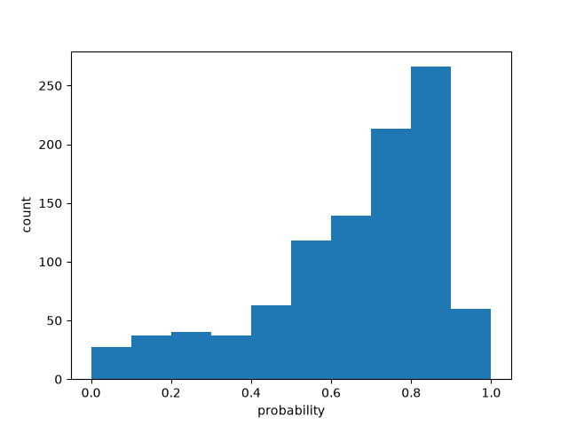

# Batch size 30

| metric | value |
| --- | ---: |
| batch_size | 30 |
| n_scored | 1000 |
| n_deadletter | 0 |
| n_requests | 34 |
| f1 | 0.6472491909385113 |
| accuracy | 0.564 |
| precision | 0.5025125628140703 |
| recall | 0.9090909090909091 |
| request_latency_ms_p50 | 171.46124349983438 |
| request_latency_ms_p90 | 340.50988809990486 |
| request_latency_ms_p99 | 390.86040734994185 |
| per_post_latency_ms_p50 | 5.6619554000008065 |
| wall_time_seconds | 1.0332802750003793 |
| input_tokens | 107268 |
| output_tokens | 18796 |
| estimated_cost_usd | 0.004505256 |
| model_versions | ['jev-1.13.0'] |
| price_source | https://docs.typesafe.ai/models (2026-09-23) |

0 deadletters.
