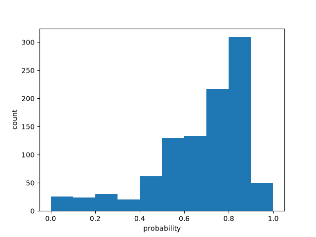

# Batch size 40

| metric | value |
| --- | ---: |
| batch_size | 40 |
| n_scored | 1000 |
| n_deadletter | 0 |
| n_requests | 25 |
| f1 | 0.6353677621283255 |
| accuracy | 0.534 |
| precision | 0.48448687350835323 |
| recall | 0.9227272727272727 |
| request_latency_ms_p50 | 154.2834810002205 |
| request_latency_ms_p90 | 303.7069296001392 |
| request_latency_ms_p99 | 325.6072000797576 |
| per_post_latency_ms_p50 | 3.8570870250055123 |
| wall_time_seconds | 0.6713678200003415 |
| input_tokens | 104982 |
| output_tokens | 18850 |
| estimated_cost_usd | 0.0044092440000000005 |
| model_versions | ['jev-1.13.0'] |
| price_source | https://docs.typesafe.ai/models (2026-09-23) |

0 deadletters.
