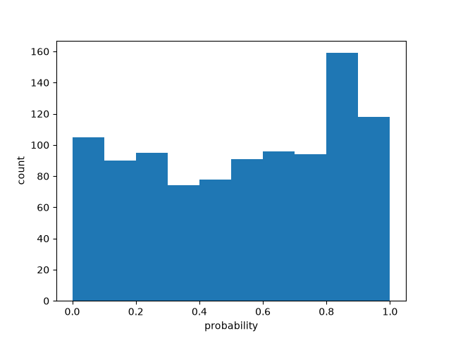

# Batch size 5

| metric | value |
| --- | ---: |
| batch_size | 5 |
| n_scored | 1000 |
| n_deadletter | 0 |
| n_requests | 200 |
| f1 | 0.7394789579158316 |
| accuracy | 0.74 |
| precision | 0.6612903225806451 |
| recall | 0.8386363636363636 |
| request_latency_ms_p50 | 128.12923549995503 |
| request_latency_ms_p90 | 181.7031963999852 |
| request_latency_ms_p99 | 334.0126386599604 |
| per_post_latency_ms_p50 | 25.625847099991006 |
| wall_time_seconds | 3.588905349000015 |
| input_tokens | 150432 |
| output_tokens | 18800 |
| estimated_cost_usd | 0.006318144 |
| model_versions | ['jev-1.13.0'] |
| price_source | https://docs.typesafe.ai/models (2026-09-23) |

0 deadletters.
